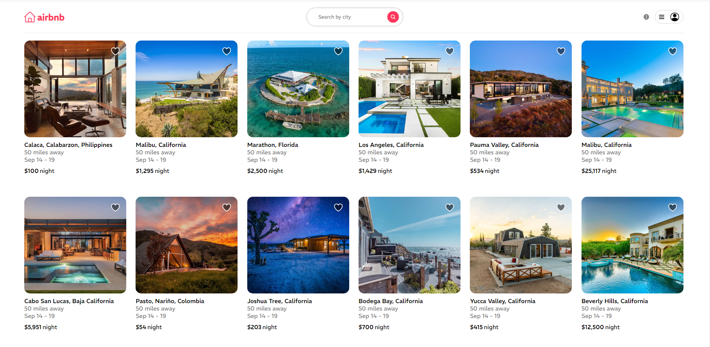
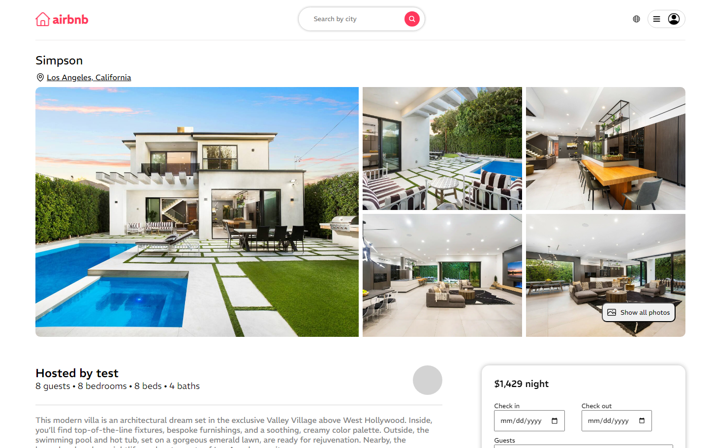
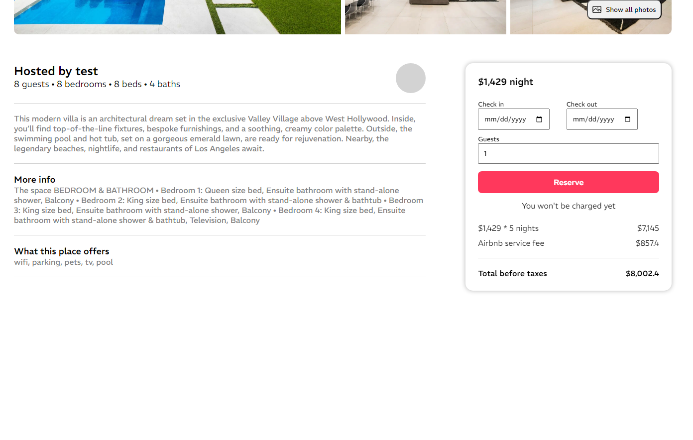
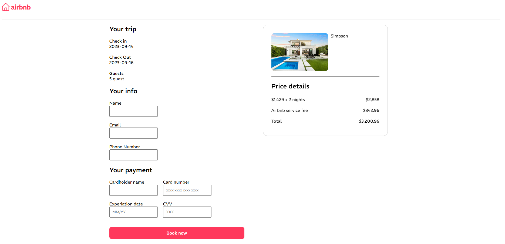

# Airbnb Clone

I've created an Airbnb clone, a platform that mimics the home-sharing concept of Airbnb. It allows users to easily rent their properties to travelers, just like Airbnb does.

## Built With

Front-end: HTML, CSS, TypeScript, React\
Back-end: NodeJS, ExpressJS, MongoDB

## Usage

